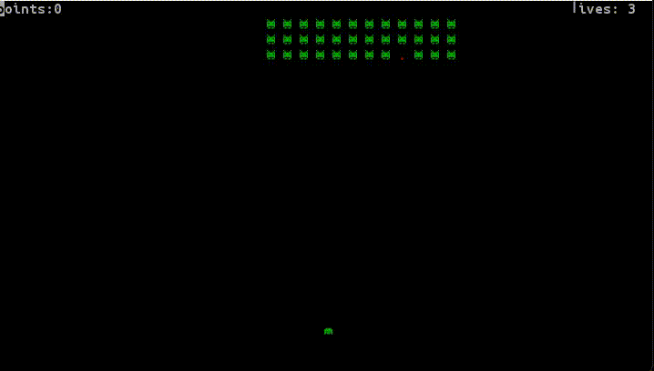
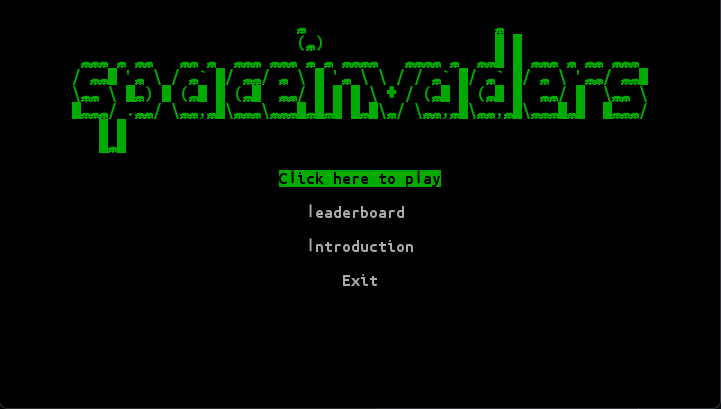
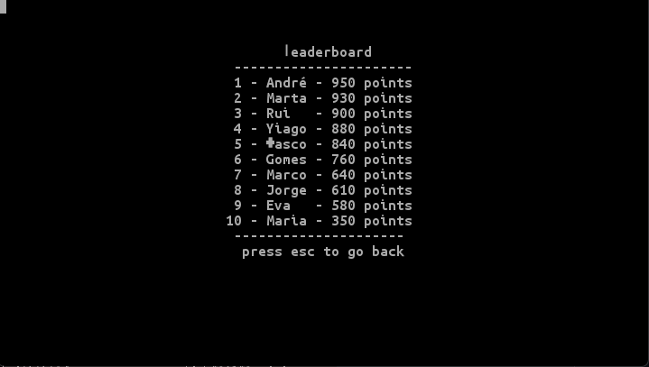
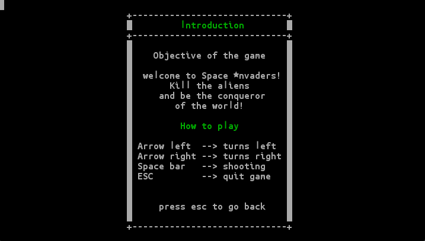
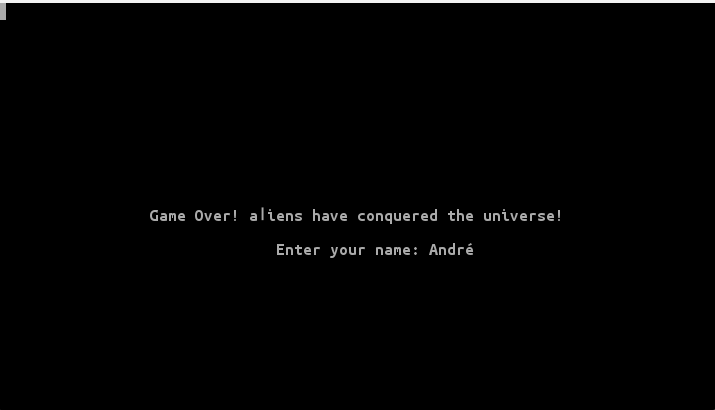

## SPACE INVAIDERS

## GAME DESCRIPTION

Welcome to Space Invaders: the last frontier between fun and intergalactic chaos! Get ready to embark on an epic journey through the cosmos where rowdy aliens have invaded outer space. It's time to show who's boss here and defend the universe with your unstoppable skills. Put on your space helmet, adjust your gravity belt and get ready for the most cosmic battle of your life! The invaders are coming, and the only thing standing between them and total destruction is... you! Let the intergalactic fun begin!

This project was developed by André Gomes (a040227@umaia.pt) for POO 2023⁄24.

## FEATURES 

- **Main Menu** - When the game is initialized the main menu is displayed, allowing the player to play the game, see the leaderboard, the introduction or exit the game.
- **Leaderboard** - The leaderboard displays the top 10 players with the highest score.
- **Introduction** - The introduction displays the game's instructions.
- **Spaceship** - The spaceship is the player's character. It can move left and right, and shoot bullets.
- **Bullets** - The bullets are the projectiles shot by the spaceship. They can destroy the aliens.
- **Aliens** - The aliens are the enemies of the game. They move left,right and down, and shoot bullets.
- **Score** - The score is the number of aliens destroyed by the player - 10 points per alien.
- **Lives** - The lives are the number of times the player can be hit by an alien bullet before losing the game.
- **Sound** - The game has sound effects and background music.
- **Bonus Power** - Collecting the bonus power reduces the number of aliens by 50%.
- **Game Over** - The game ends when the player loses all lives.

## Game Mechanics

For proper interaction within the game, players should use the following control scheme:

- **Left Arrow Key** [<-] Moves the character to the left, allowing lateral movement in that direction.
- **Right Arrow Key**[->] Moves the character to the right, facilitating lateral progression in this direction.
- **Space Bar** executes the shooting action, crucial for engaging with challenges and adversaries.
- **ESC** returns the player to the main menu.

## Screenshots

The following screenshots illustrate the game's main menu, as well as the game itself.

### Playing the game 

### Menus
**Main menu**

**Leaderboard**

**Introduction**

**Game Over**

## Author

This project was developed by André Gomes (a040227@umaia.pt) for POO 2023⁄24.