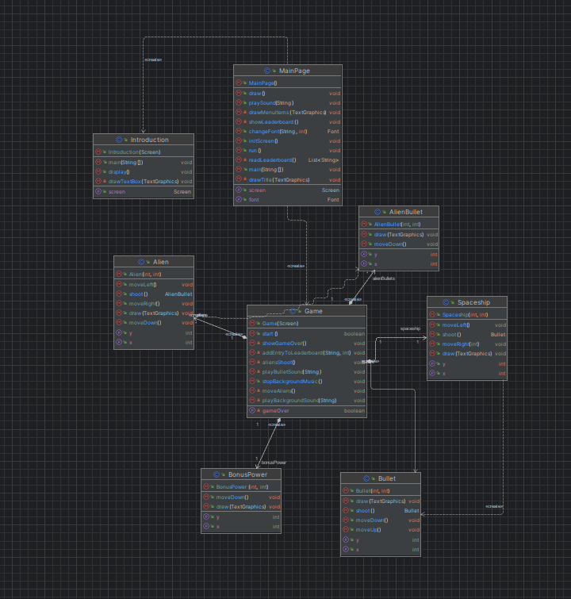
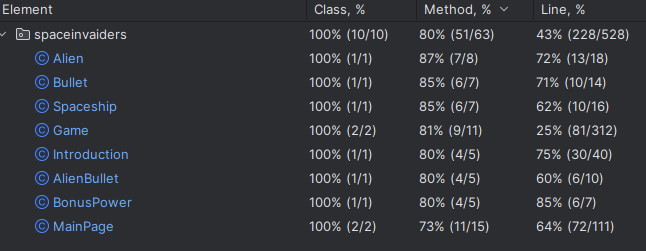

# SPACE INVAIDERS

## GAME DESCRIPTION

Welcome to Space Invaders: the last frontier between fun and intergalactic chaos! Get ready to embark on an epic journey through the cosmos where rowdy aliens have invaded outer space. It's time to show who's boss here and defend the universe with your unstoppable skills. Put on your space helmet, adjust your gravity belt and get ready for the most cosmic battle of your life! The invaders are coming, and the only thing standing between them and total destruction is... you! Let the intergalactic fun begin!

This project was developed by André Gomes (a040227@umaia.pt) for POO 2023⁄24.

## FEATURES

### PLANNED FEATURES

- **Vehicle** - Maybe a spaceship or another vehicle, who knows?
- **Movement** - The vehicle can move in all directions when we press the arrow keys.
- **Shooting** - It will be possible to shoot lasers.
- **Enemy** - There will be monsters that we should shoot at.
- **Score** - There will be a score for each game.
- **Score Ranking** - There will be a ranking of the scores of the 10 best players.
- **Lives** - The player has an amount of lives that decreases every time he dies.
- **Game Over** - When the player runs out of lives, the game ends.

### IMPLEMENTED FEATURES

- All features were implemented

## IMPLEMENTATION - UML DIAGRAM

### TESTING

### SELF-EVALUATION

- André Gomes: 100%

